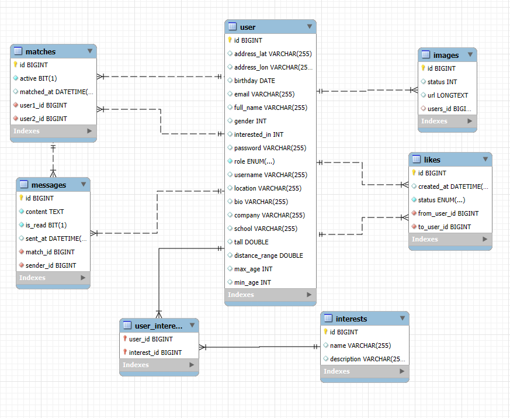

# Tài liệu thiết kế dự án: Ứng dụng Hẹn hò (Tinder Clone)

Đây là tài liệu thiết kế và kỹ thuật cho dự án backend của ứng dụng hẹn hò, xây dựng bằng Spring Boot.

## 1. Mục tiêu Dự án (Project Objective)

Dự án này là một ứng dụng hẹn hò (Tinder-style) được xây dựng cho mục đích học tập và xây dựng portfolio. Mục tiêu cốt lõi là tạo ra một nền tảng backend vững chắc, có khả năng mở rộng, cho phép người dùng:

* Tìm kiếm các hồ sơ người dùng khác trong khu vực của họ.
* Thể hiện sự quan tâm (hoặc không quan tâm) một cách riêng tư.
* Chỉ kết nối và trò chuyện khi có sự đồng ý (tương hợp) từ cả hai phía.

Dự án tập trung vào việc thiết kế CSDL quan hệ hiệu quả, xử lý logic nghiệp vụ phức tạp (như "match" và "like"), và triển khai giao tiếp thời gian thực (real-time) cho tính năng chat.

## 2. Thành viên Nhóm (Team Members)

| STT | Họ và Tên          | Vai trò                  | Link GitHub |
| :--- |:-------------------|:-------------------------| :--- |
| 1 | [Hoàng Hải Nam]    | Team Lead, FullStack Dev | `[github_username](link_github_cua_ban)` |
| 2 | [Vũ Duy Lê]        | FullStack Dev              | `[github_username]` |

## 3. Công nghệ sử dụng (Technology Stack)

* **Backend:** Java 17+, Spring Boot 3+
* **Bảo mật:** Spring Security (Xác thực bằng JWT)
* **Database:** MySQL, Spring Data JPA, JDBC
* **Lưu trữ Ảnh:** Supabase Storage
* **Real-time:** Spring WebSocket (STOMP)
* **Build Tool:** Maven

---

## 4. Tổng quan Chủ đề & Sơ đồ ERD

**Tên dự án:** Ứng dụng Hẹn hò (Tinder-style)
**Mục tiêu:** Xây dựng một ứng dụng di động/web cho phép người dùng tìm kiếm, kết nối, và trò chuyện với những người dùng khác dựa trên sự tương hợp (mutual "like" - cùng thích lẫn nhau).

**Sơ đồ ERD (Entity Relationship Diagram)**



---

## 5. Sơ đồ Use Case (Use Case Diagram)

Dưới đây là các tác nhân (Actors) và các ca sử dụng (Use Cases).

#### 5.1. Tác nhân (Actors)

1.  **User (Người dùng):** Người dùng cuối của ứng dụng.
2.  **Admin (Quản trị viên):** Người quản lý hệ thống (dựa trên `role` trong bảng `user`).
3.  **System (Hệ thống):** Tự động xử lý các tác vụ nền.

#### 5.2. Ca sử dụng (Use Cases)

**A. Use Cases cho "User"**

* **Quản lý Tài khoản & Hồ sơ:**
    * `Register Account`: Tạo một bản ghi mới trong bảng `user`.
    * `Login`: Xác thực thông tin đăng nhập (`email`, `password`).
    * `Update Profile`: Cập nhật `bio`, `company`, `school`, `tall`.
    * `Upload/Manage Photos`: Thêm/xóa/sắp xếp các bản ghi `images`.
* **Quản lý Tùy chọn (Preferences):**
    * `Set Matching Preferences`: Cập nhật `distance_range`, `max_age`, `min_age`.
    * `Get Current Location`: Cập nhật vị trí hiên tại của user (`location`).
    * `Manage Interests`: Thêm/xóa các bản ghi `user_interests`.
* **Lõi Tương tác (Core Interaction):**
    * `View Potential Matches`: Hệ thống truy vấn và hiển thị các hồ sơ `user` khác.
    * `Swipe Right (Like)`: Gửi hành động `status` = 'LIKE'.
    * `Swipe Left (Pass)`: Gửi hành động `status` = 'DISLIKE'.
* **Kết nối và Nhắn tin (Matching & Chatting):**
    * `View Matches`: Xem danh sách các bản ghi `matches` (`active` = true).
    * `Send Message`: Tạo bản ghi `messages` liên kết với `match_id`.
    * `Read Message`: Cập nhật `is_read` = true.
    * `Unmatch User`: Cập nhật `matches` thành `active` = false.

**B. Use Cases cho "Admin"**

* `Manage Users`: CRUD các bản ghi `user`.
* `Manage Interests`: CRUD các bản ghi `interests` (dữ liệu master).
* `View System Analytics`: Xem thống kê về số lượng `User`, `matches`, `messages`.

**C. Use Case cho "System": Xử lý Hành động Tương tác (Like/Dislike)**

* **Trigger:** `User A` gửi một hành động (`LIKE` - status 0, `DISLIKE` - status 1) lên hồ sơ của `User B`.
* **Hành động và Kết quả:**
  Hệ thống kiểm tra xem `User B` đã có hành động nào nhắm đến `User A` *trước đó* hay chưa.

    * **Kịch bản 1: MATCH! (Tương hợp)**
        * **Điều kiện:** `User B` đã `LIKE` `User A` từ trước, VÀ hành động *hiện tại* của `User A` cũng là `LIKE` `User B`.
        * **Hành động của Hệ thống:**
            1.  **Xử lý "Like":** **Xóa** bản ghi `like` cũ của `User B`.
            2.  **Tạo Match:** Tạo một bản ghi mới trong `matches` (`active = true`).
            3.  **Thông báo Real-time:** Gửi `MatchNotification` qua WebSocket đến *cả hai* người dùng.

    * **Kịch bản 2: Hành động một chiều (Lưu trữ và Chờ)**
        * **Điều kiện:** `User A` `LIKE` `User B`, nhưng `User B` chưa có hành động gì (hoặc đã `DISLIKE`).
        * **Hành động của Hệ thống:**
            1.  **Lưu trữ hành động:** Tạo một bản ghi mới trong `likes` (`from_user` = A, `to_user` = B).
            2.  **Thông báo (Nếu Like):** Gửi `LikeNotification` qua WebSocket *chỉ cho* `User B`.

    * **Kịch bản 3: Cùng "Dislike" (Bỏ qua)**
        * **Điều kiện:** `User B` đã `DISLIKE` `User A` từ trước, VÀ `User A` cũng `DISLIKE` `User B`.
        * **Hành động của Hệ thống:** Không hành động, không tạo bản ghi mới.

---

## 6. Phân tích Sơ đồ Cơ sở dữ liệu

Mô tả chi tiết cho ERD.

#### 6.1. Bảng `user`
* **Mục đích:** Bảng trung tâm, lưu trữ mọi thông tin về người dùng.
* **Các cột chính:** `email`, `password` (xác thực); `full_name`, `birthday` (nhân khẩu học); `bio`, `company` (hồ sơ); `address_lat`, `address_lon` (vị trí); `distance_range`, `max_age` (bộ lọc); `role` (phân quyền).
* **Quan hệ:** 1-N với `images`, 1-N với `likes` (cả `from_user_id` và `to_user_id`), N-M với `interests`.

#### 6.2. Bảng `images`
* **Mục đích:** Lưu trữ các hình ảnh profile của người dùng.
* **Các cột chính:** `url` (đường dẫn SupaBase Storage), `status` (1 = avatar, 0 = ảnh thường), `user_id` (khóa ngoại).

#### 6.3. Bảng `interests`
* **Mục đích:** Bảng "master data" chứa danh sách tất cả các sở thích (ví dụ: "Hiking", "Coding").

#### 6.4. Bảng `user_interests`
* **Mục đích:** Bảng nối (junction table) cho quan hệ N-M giữa `user` và `interests`.

#### 6.5. Bảng `likes`
* **Mục đích:** Ghi lại mọi hành động "swipe" ở trạng thái "chờ" (chưa tạo thành match).
* **Các cột chính:** `from_user_id`, `to_user_id`, `status` (ENUM: 'LIKED', 'PASSED', 'SUPERLIKED').

#### 6.6. Bảng `matches`
* **Mục đích:** Ghi lại một kết nối thành công (mutual like). Chỉ khi có bản ghi ở đây, hai người mới có thể nhắn tin.
* **Các cột chính:** `user1_id`, `user2_id`, `active` (BIT(1) - `true` = còn match, `false` = đã unmatch).

#### 6.7. Bảng `messages`
* **Mục đích:** Lưu trữ toàn bộ lịch sử trò chuyện.
* **Các cột chính:** `content`, `sent_at`, `is_read`, `sender_id`, `match_id` (khóa ngoại đến `matches`).

---

## 7. Luồng nghiệp vụ chính (Key Business Flows)

**7.1. Luồng "Swipe" và "Match" (The Swipe & Match Flow)**

1.  **User A** đăng nhập. Hệ thống tải các hồ sơ (User B, C, D) dựa trên tùy chọn của User A.
2.  **User A** "Swipe Right" (Like) **User B**.
3.  Hệ thống nhận hành động: `User A` (ID: A) thực hiện `status = 0` (LIKE) lên `User B` (ID: B).
4.  **Hệ thống (System)** kiểm tra: "Có tồn tại bản ghi `likes` nào mà `{ from_user_id: B, to_user_id: A, status: 'LIKED' }` không?"
5.  **Trường hợp 1 (Không có - Like một chiều):**
    * Tạo một bản ghi mới trong `likes`: `{ from_user_id: A, to_user_id: B, status: 'LIKED' }`.
    * Gửi thông báo WebSocket `/topic/like/{userB_id}` đến User B.
6.  **Trường hợp 2 (Có - IT'S A MATCH!):**
    * Hệ thống tìm thấy bản ghi `like` từ B đến A.
    * Hệ thống **xóa** bản ghi `like` đó: `DELETE FROM likes WHERE from_user_id = B AND to_user_id = A`.
    * Hệ thống tạo một bản ghi mới trong `matches`: `{ user1_id: A, user2_id: B, active: 1, matched_at: NOW() }`.
    * Hệ thống gửi thông báo WebSocket `/topic/match/{userA_id}` và `/topic/match/{userB_id}`.

**7.2. Luồng Nhắn tin (The Chat Flow)**

1.  **User A** vào danh sách "matches" của mình (truy vấn bảng `matches`).
2.  Ứng dụng mở màn hình chat, lấy `match_id` (ví dụ: `123`) từ bản ghi "match" A-B.
3.  Ứng dụng tải tất cả tin nhắn: `SELECT * FROM messages WHERE match_id = 123 ORDER BY sent_at ASC`.
4.  **User A** gửi tin "Chào em!".
5.  Hệ thống tạo bản ghi mới trong `messages`: `{ content: "Chào em!", is_read: 0, sender_id: A, match_id: 123 }`.
6.  Hệ thống gửi tin nhắn này qua WebSocket đến **User B** (thành viên còn lại của `match_id = 123`).
7. 
**7.3. Luồng Gợi ý Người dùng (Recommendation Flow) `**

1.  **User A** đăng nhập.
2.  Hệ thống lấy hồ sơ User A, tạo vector đại diện (từ bio, sở thích, v.v.).
3.  Hệ thống truy vấn **Qdrant**: "Tìm 100 user (vector) gần nhất với vector của User A".
4.  Hệ thống lấy danh sách 100 ID user trả về, truy vấn **Mysql** để lọc theo tiêu chí cứng (tuổi, giới tính, những người A chưa "swipe").
5.  Giả sử còn lại 50 user (User B, C, D...).
6.  Hệ thống gọi **GraphHopper API** cho từng user: "Tính khoảng cách di chuyển từ A (lat/lon) đến B (lat/lon)".
7.  Hệ thống lọc tiếp những user nằm trong `distance_range` (ví dụ: < 10km) của User A.
8.  Kết quả cuối cùng được trả về cho User A để "quẹt".
---

## 8. Hướng dẫn Cài đặt và Chạy (Setup & Installation)

Để chạy dự án này trên máy local của bạn, vui lòng làm theo các bước sau:

### 8.1. Yêu cầu Bắt buộc (Prerequisites)

* **Java:** JDK 17 hoặc mới hơn.
* **Database:** Một máy chủ MySQL đang chạy.
* **Build Tool:** Maven 3.x trở lên.
* **Message Broker:** RabbitMQ (hoặc ActiveMQ) nếu bạn cấu hình STOMP qua broker.

### 8.2. Cài đặt

1.  **Clone repository về máy:**
    ```bash
    git clone [https://github.com/tsui24/Tinder.git]
    cd [Tinder]
    ```

2.  **Tạo Cơ sở dữ liệu:**
    * Đăng nhập vào `mysql` (hoặc công cụ quản lý DB của bạn).
    * Tạo một database mới cho dự án:
        ```sql
        CREATE DATABASE tinderweb_test;
        ```

   3.  **Cấu hình Môi trường:**
       * Tìm và mở tệp `src/main/resources/application.properties` (hoặc `application.yml`).
       * Cập nhật các thông tin sau để trỏ đến database của bạn:
           ```properties
           # Cấu hình Database
           spring.datasource.url=jdbc:mysql://localhost:3306/tinderweb_test
           spring.datasource.username=root
           spring.datasource.password=matkhau_cua_ban

           # Cấu hình JPA (để Spring tự động tạo bảng dựa trên Entities)
           spring.jpa.hibernate.ddl-auto=update
           spring.jpa.properties.hibernate.dialect=org.hibernate.dialect.PostgreSQLDiallDialect
        
           # Cấu hình JWT Secret
           jwt.secret.key=DAY_LA_KHOA_BI_MAT_CUA_BAN_HAY_THAY_DOI_NO
      
           # Cấu hình API Dịch vụ ngoài (GraphHopper)
           graphhopper.api.key=[YOUR_GRAPHHOPPER_API_KEY]
           graphhopper.api.url=[https://graphhopper.com/api/1/route](https://graphhopper.com/api/1/route)
         
            # Cấu hình Gửi Mail (SMTP)
            spring.mail.host=smtp.gmail.com
            spring.mail.port=587
            spring.mail.username=[YOUR_GMAIL_USERNAME]
            spring.mail.password=[YOUR_GMAIL_APP_PASSWORD]
           ```

### 8.3. Chạy ứng dụng

1.  **Sử dụng Maven:**
    ```bash
    mvn spring-boot:run
    ```

2.  **Sử dụng IDE:**
    * Mở dự án bằng IntelliJ hoặc Eclipse.
    * Tìm đến file chính (`...Application.java`) và nhấn "Run".

Sau khi khởi động thành công, ứng dụng sẽ chạy tại địa chỉ: `http://localhost:8080`.